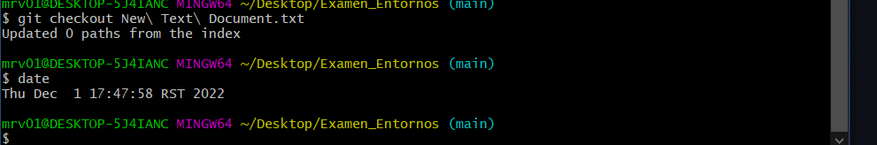

# Prácticas A y B , procedimiento para solucionarlas:
---
1.Crear un directorio y dentro del mismo crear un archivo de texto.

---
2.Damos click derecho y en el menú desplegado seleccionamos _*Git Bash Here*_.


---
3.Ejecutamos el comando ```git init```.

---
4.Comprobamos el estado del _WorkSpace_ ejecutando el comando ```git status - s``` , donde observamos que nuestro archivo no ha sido indexado,es decir, no tiene seguimiento.


---
5.Procedemos a ejecutar el comando ```git add``` seguido del nombre de nuestro archivo o ```git add .``` e indexamos todos los archivos y directorios del _WorkSpace_.


---
6.Ejecutamos nuevamente el comando ```git status -s``` y comprobamos que justo al lado de el archivo aparece una _(A)_ de color verde indicando que el archivo se encuentra en _(staged area)_, es decir ,_está indexado_ listo para formar parte del historial de cambios del proyecto.


---
7.Ejecutamos el comando  ```git commit -m "Aquí podemos poner cualquier mensaje"``` eviando nuestro archivo de texo a _(Local Repository)_, es decir, nuestro historial de cambios o podría asociarse también con fotos de nuestro código.


---
8.Si ejecutamos el comando ```git status -s``` esta vez no nos saldrá ningún archivo , lo que indica que todos están en _(Local Repository)_ y desde el último cambio que guardamos,no hubo ninguno más.

---
9.Si deseamos ver el historial de cambios a lo largo del tiempo podemos ejecutar el comando ```git log --oneline```.


---
10.Para poder subir dicho archivo a un repositorio externo como __GitHub__ o __GitLab__ debemos previamente crearnos un repositorio en el sitio web [GitHub](https://github.com/) o [GitLab](https://gitlab.com/) usando nuestra cuenta.

---
11.Una vez dentro y con nuestra cuenta creada , damos en el botón de nuevo repositorio.


---
12.Le damos un nombre.


---
13.Damos en el botón crear.


---
14.Copiamos la url del repositorio.


---
15.Nos dirigimos a la consola git y ejecutamos el comando ```git remote add origin``` _[url del repositorio](https://github.com/MRodriguezValdes/Ejercicios-A-y-B.git)_


---
16.Ejecutamos el comando ```git branch -M main```


---
17.Por último ejecutamos el comando ```git push -u origin main```, si es primera vez que ejecutamos este comando en nuestro ordenador , nos solicitará las credenciales de nuestra cuenta en github.


---
18.Siguiendo los pasos anteriores ya tendríamos nuestro archivo en git hub 


# Modificaciones:

1.Esta línea ha sido insertada en _GitHub_ y posteriormente haré un ```commint``` de ella para actualizar los cambios en mi repositorio local haciendo uso del comando ```git pull orgin main ```


2.Si hacemos un cambio en el documento y antes de ejecutar el comando ```git add nombre_del_archivo``` ejecutamos el comando ```git checkout nombre_del_archivo``` todos los cambios se deshacen.


3.Si hacemos un cambio en el documento y luego ejecutamos el comando ```git add nombre_del_documento``` y autoseguido intentamos lo comentado anteriormente ```git checkout nombre_del_archivo``` observamos que no sucede nada porque ya hemos indexado el archivo, es decir , ahora se encuentra en la _(staged area)_ y primero debemos sacarlo de ahí para poder ejecutar el comando anterior , para ello, hacemos uso del comando ```git reset HEAD nombre_del_archivo``` y luego aplicamos el comando ```git checkout nombre_del_archivo``` y observamos que todos los cambios en el documento se deshacen.





4.Para regresar a una versión específica de un archivo de forma temporal ejecutamos el comando ```git checkout hash_del archivo nombre_del_archivo```

- El hash del archivo en sus diferentes versiones podemos buscarlo en:
    
    - _GitHub_:Damos click en el archivo y luego nos dirigimos a _history_,donde encontramos las diferentes versiones del mismo y podemos acceder al hash que deseemos.
    - Ejecutando el comando ```git log -- oneline``` nos sale justo al lado de cada commit.


6.Si perdemos nuestro proyecto y lo tenemos en github podemos clonarlo al directorio que deseemos haciendo uso del comando ```git clone``` [url del proyecto](https://github.com/MRodriguezValdes/Ejercicios-A-y-B.git)


```Con esto damos por concluidos los Ejercicios de la primera practica```


# Práctica_2:

# Paso#1:

Ejecutamos el comando ```git log --oneline --all``` para listar todos los commits de nuetro proyecto.

Nos aparecerá la lista con nuestros commits, a la izquierda tendremos el hash de cada commit , a la derecha el nombre de cada commit y lo que aparece entre paréntesis ```(HEAD -> main) Commit 3```, HEAD apunta por defecto al último commit que realizamos pero podemos movernos a través de los commits usando el comando ```git checkout hash_del_commit``` y main es el nombre de la rama en la que me encuentro en esos momentos.

# Paso#2 :

Ejecutamos el comando ```cat nombre_del_txt``` para ver el contenido del archivo txt en el commit que nos encontramos.


# Paso#3 :

Ejecutamos el comando ```git checkout hash_del_commit``` para movernos a otro commit.


# Paso#4 :

Ejecutamos nuevamente el comando ```cat nombre_del_txt``` para ver el contenido en el commit actual.


# Paso#5 :

Ejecutamos el comando ```git log --oneline --all``` para ver donde nos encontramos.


Vemos que nos encontramos en el commit 1.

# Paso#6 :

Volvemos a ejecutar el comando ```git checkout hash_del_commit``` para movernos a otro commit.


# Paso#7 :

Volvemos a ejecutar el comando ```cat nombre_del_txt``` para visualizar su contenido.


# Paso#8 :

Ejecutamos nuevamente el comando ```git log --oneline --all``` para ver donde nos encontramos.


Como podemos observar nos encontramos en el commit 2.

# Paso#9 :

Ejecutamos el comando ```git checkout nombre_rama_principal``` para movernos al inicio del todo y poder continuar nuestro proyecto desde donde lo dejamos. 


# Paso#10 :

Volvemos a ejecutar el comando ```cat nombre_del_txt``` para visualizar su contenido.


# Paso#11 :

Ejecutamos nuevamente el comando ```git log --oneline --all``` para ver donde nos encontramos.


Como podemos observar nos encontramos de vuelta en el ultimo commit realizado.


```Ejercicio completado ```
Directorio de trabajo es el lugar en el que  normalmente trabajamos 
es decir antes de ejecutar ```git add .```

Area de preparacion es donde se encuentra el documento cuando ejecutamos el comando ```git add .```


Repositorio local es cuando ejecutamos el comando ```git commit -m ""```